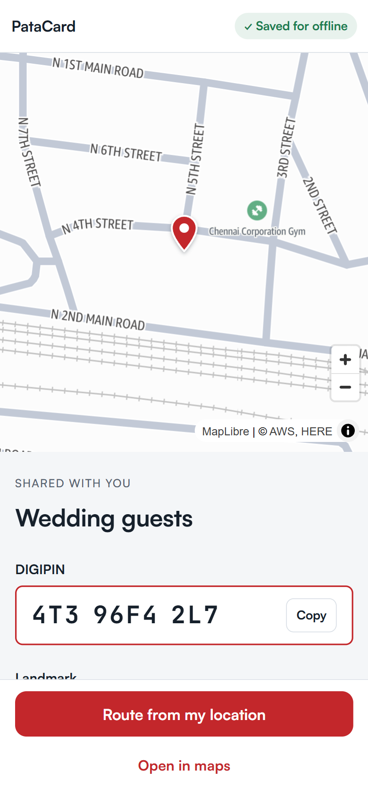
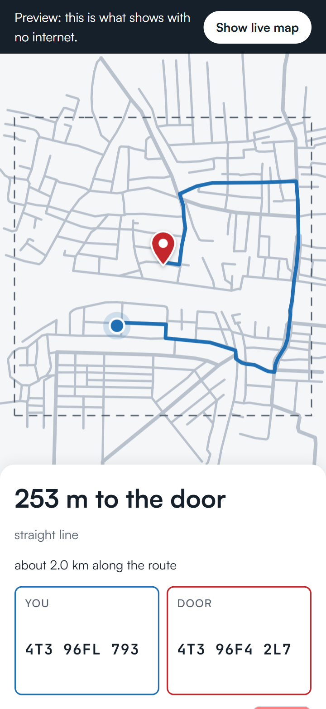
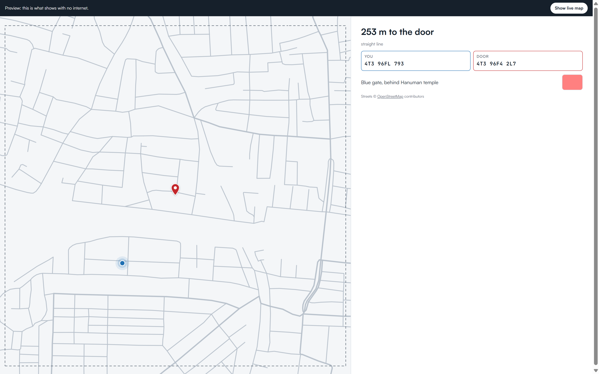
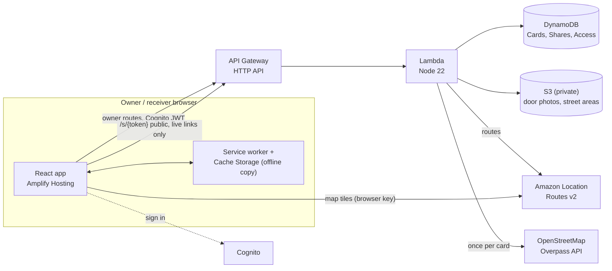

# DigiLease

**An address you can hand over, and take back.**

India's PIN code stops at the locality, so addresses run on landmarks, and ambulances and delivery riders lose time finding the door. India Post's DIGIPIN gives every ~3.8 m square of India a 10-character code, but people can't share it safely: there's no way to say *who* sees it, *for how long*, and to take it back.

DigiLease turns your DIGIPIN into an address card, with a landmark note and a door photo. You share it as separate links, one per receiver, each with an expiry. You see who opened each link and can revoke it any time. The receiver needs no app and no login: they see the exact spot and get a route to your door.

Built for the WeMakeDevs x AWS **First Commit** hackathon (Ship It track). Problem source: Shaastra 2026 (IIT Madras) x India Post, *Digital Address DPI Innovation Hackathon*.

**Live:** https://main.d109k3dqf4r860.amplifyapp.com · **Demo video:** _link added at submission_

## How it works
1. Drop a pin (GPS or drag). The DIGIPIN updates live.
2. Add a landmark ("blue gate, behind temple") and a door photo.
3. Create a link per receiver: "Ambulance, 24 h", "Courier, 2 h", or "Wedding guests, no expiry". Each has a QR code, and a printable A6 card for the gate or an invitation.
4. The receiver opens the link and sees the spot, the photo and a route. The page saves itself on their phone.
5. **The last kilometre works with no signal.** In airplane mode the saved page still opens: the streets around the door, the route, a blue "you" dot from GPS, both DIGIPINs ("You: …", "Door: …") and the distance to go.
6. You see "Ambulance opened at 14:02". Revoke it, and the link dies.
7. Done with a door entirely? Delete the card. That removes the door photo, the cached street area, every link issued from it and the access history in one go.

Your cards live on `/cards`, a carousel of address passes you can page through; each one opens its links, QR codes and printable A6 card. The whole app has a light and a dark theme, and the choice sticks.

## Why not just share a location on WhatsApp or Google Maps?
Those are great for "where am I right now". DigiLease is for "where is my door", given to people you don't know, on your terms.

| Need | WhatsApp / Google Maps pin | DigiLease |
|---|---|---|
| Shares the **place**, not the person | Live location follows *you*; a static pin is just a dot | The card is your door, whether or not you're home |
| Landmark + door photo with the location | Separate messages, lost in a chat | One link: exact spot, landmark note and door photo |
| No phone numbers exchanged | The receiver must be in your contacts | A link or QR for any app's delivery notes, or printed on the door |
| Take it back | A shared pin stays in their chat | Revoke any time; the link stops working |
| Know who opened it | No record | Access log per link ("Ambulance opened at 14:02") |
| Say it on a call | Coordinates can't be read out | A 10-character DIGIPIN like `4T3 96F4 2L7` can be |
| Works where the signal drops | Needs data to load the map | The saved street map, GPS dot and distance work offline |
| National standard | A provider's own system | India Post's DIGIPIN |

DigiLease is a working prototype of the consent layer India Post has planned for DIGIPIN (DHRUVA): addresses shared with consent, per receiver, revocable.

## Screenshots
| Receiver, online | Offline map (phone) | Offline map (laptop) |
|---|---|---|
|  |  |  |

## Architecture

- **AWS services:** Amplify Hosting, API Gateway, Lambda, DynamoDB, S3, Cognito, Amazon Location Service, CloudWatch Logs. One SAM template (`template.yaml`) in ap-south-1 (Mumbai).
- **Offline streets come from OpenStreetMap**, not Amazon's map. The Lambda fetches the streets within 500 m of the door once, keeps them in S3, and the receiver's phone stores them. We didn't find a clear statement that Amazon's map data may be stored on a phone for offline use, so we don't; OpenStreetMap's licence (ODbL) allows it with credit.
- **Cost:** about $0 at demo scale (free tiers; a few Location Service route calls).

## Pitch deck
`docs/DigiLease-deck.pptx` — 14 slides, the demo running order, built from the live screenshots in this repo. Speaker notes are not in the file; the running order is the slide order.

## Security in brief
- Share links are 128-bit random tokens. Every public call checks that the link is neither revoked nor expired.
- Owner routes need a Cognito login, and ownership is checked on every call. The server computes every DIGIPIN; the browser's code is never trusted.
- The photo bucket is private; photos are served by 5-minute signed URLs. Uploads are limited to 5 MB JPEG/PNG by the signed upload itself.
- CORS and the map key allow only the live site (and localhost for development). The API is throttled to 10 requests a second.
- Logs never include coordinates, landmarks or tokens.
- **Known limits:** a receiver can screenshot what they saw, and an offline copy lasts until the phone next goes online (or the link expires). Revoking stops all online access at once.

## What we learned
- **A service worker needs `ignoreVary`.** Hosts send `Vary: Origin`, and module scripts carry an `Origin` header, so a strict cache lookup misses the app's own files offline.
- **An Amazon Location API key that was used in the last 7 days refuses restriction changes** unless the template sets `ForceUpdate: true`. Our first go-live deploy rolled back on it.
- **MapLibre v6's worker breaks when Vite bundles it**, with no error shown. We serve the worker files from `/maplibre/`, and the hosting rewrite rule must not catch `.mjs` files.
- **SAM silently drops HTTP API CORS built with `!If`.** Plain lists work.
- **Overpass is a shared public service.** One fetch per card, cached in S3, and a 30-second pause after any error.

## Run it yourself
See [`docs/SETUP.md`](docs/SETUP.md).

## Credits
DIGIPIN encoder/decoder © India Post, Department of Posts. Apache License 2.0: [`INDIAPOST-gov/digipin`](https://github.com/INDIAPOST-gov/digipin). Used unmodified in `backend/src/digipin.js`.

Offline street data © [OpenStreetMap](https://www.openstreetmap.org/copyright) contributors, available under the Open Database License (ODbL).
